# 🚀 Hướng Dẫn Phối Hợp & Mô Phỏng Quy Trình Làm Việc Nhóm 3 Người (Hackathon Vòng Phụ)
## Chủ đề: Tối ưu hóa hiệu suất với sự hỗ trợ của AI (Copilot, Claude, GPT, Gemini)

Tài liệu này hướng dẫn chi tiết cách nhóm 3 người phối hợp nhịp nhàng trong **2 giờ 30 phút** của vòng thi phụ để phát triển một tính năng đột xuất. Để minh họa trực quan, tài liệu lấy ví dụ cụ thể về tính năng: **Accessible Pathfinding (Đường đi không rào cản - Định tuyến tránh cầu thang bộ, chỉ dùng thang máy cho người khuyết tật/xe đẩy)**.

---

## 1. Bản Đồ Phân Vai & Công Cụ AI Phù Hợp

Trong môi trường hackathon áp lực thời gian cao, việc chọn đúng mô hình AI cho từng loại tác vụ là yếu tố quyết định tốc độ và chất lượng mã nguồn:

| Vai Trò | Tác Vụ Cốt Lõi | AI Khuyên Dùng | Lý Do Chọn |
| :--- | :--- | :--- | :--- |
| **Thành viên A**<br>(UI/UX Lead) | Giao diện React, CSS, hiệu ứng mượt mà, đồng bộ state Zustand. | **Claude 3.5 Sonnet** hoặc **GPT-4o** | Vượt trội về khả năng dựng UI hiện đại từ mô tả ngôn ngữ tự nhiên, ít lỗi logic component hơn. |
| **Thành viên B**<br>(Backend Lead) | API FastAPI, Database, Supabase JWT Auth, Groq AI Router. | **Claude 3.5 Sonnet** hoặc **GitHub Copilot** | Khả năng refactor code Python sạch sẽ, tuân thủ chặt chẽ kiến trúc backend hiện tại. |
| **Thành viên C**<br>(Algo & Workers) | Thuật toán Theta*, Web Worker, tính toán hình học, tối ưu hóa RAM/CPU. | **Gemini 1.5 Pro** hoặc **Claude 3.5 Sonnet** | Gemini có khả năng phân tích ngữ cảnh lớn (long-context) rất tốt khi cần nạp file thuật toán dài và tối ưu hóa logic toán học. |

---

## 2. Kịch Bản Mô Phỏng 150 Phút Vòng Phụ (Đề bài: Accessible Pathfinding)

Dưới đây là tiến trình làm việc chi tiết từng phút của cả team từ khi BTC công bố đề bài:

```mermaid
gantt
    title Kịch bản phối hợp 150 phút (Vòng Phụ)
    dateFormat  X
    axisFormat %H:%M
    section Lập kế hoạch
    Hội ý & Thiết kế API Contract : active, 0, 15
    section Thành viên A (UI)
    Thiết kế UI & Toggle Switch : 15, 60
    Tích hợp Zustand & Map View   : 60, 120
    section Thành viên B (Backend)
    Cập nhật API & Schema DB     : 15, 75
    Viết Mock Data & Test API    : 75, 120
    section Thành viên C (Algo)
    Đọc thuật toán & Sửa Worker  : 15, 75
    Tích hợp & Đo hiệu năng      : 75, 120
    section Tích hợp & Demo
    Hợp nhất Git & Test End-to-End : 120, 150
```



### ⏱️ Pha 1: Lập kế hoạch & Thống nhất API Contract (Phút 0 - 15)
* **Hoạt động:** Cả 3 người ngồi lại vẽ sơ đồ luồng dữ liệu.
* **API Contract thống nhất:**
  * Client sẽ gửi thêm tham số `avoidStairs: boolean` (hoặc `preferElevator: boolean` đã có nhưng cần xử lý triệt để hơn) qua API hoặc qua payload của Web Worker.
  * Phía Web Worker ([pathfinder.worker.v2.js](file:///d:/fptustudent%20guild/FPTU_Student_Guide/frontend/src/workers/pathfinder.worker.v2.js)) sẽ nhận tham số này để thay đổi trọng số di chuyển.

---

### ⏱️ Pha 2: Thực thi độc lập phối hợp AI (Phút 15 - 120)

#### 👤 THÀNH VIÊN A (UI/UX) - Thiết kế công tắc Toggle và Đồng bộ State
* **Công cụ sử dụng:** VS Code + Claude 3.5 Sonnet.
* **Hành động:** 
  1. Thêm một công tắc chuyển đổi (Toggle Switch) "Chế độ không rào cản" vào [PathfindingPanel.jsx](file:///d:/fptustudent%20guild/FPTU_Student_Guide/frontend/src/components/map/PathfindingPanel.jsx).
  2. Đồng bộ giá trị của Toggle Switch với biến `preferElevator` trong [useAppStore.js](file:///d:/fptustudent%20guild/FPTU_Student_Guide/frontend/src/stores/useAppStore.js).
* **Prompt mẫu gửi Claude 3.5 Sonnet:**
  > *"Tôi đang làm dự án React.js. Tôi có file store Zustand [useAppStore.js](file:///d:/fptustudent%20guild/FPTU_Student_Guide/frontend/src/stores/useAppStore.js). Hãy viết cho tôi một component Toggle Switch tên là `AccessibilityToggle` bằng React sử dụng thư viện `lucide-react` để đổi trạng thái của biến `preferElevator` (true/false). Yêu cầu giao diện mang phong cách Glassmorphism, có tooltip giải thích 'Ưu tiên thang máy, tránh hoàn toàn cầu thang bộ dành cho người khuyết tật/xe đẩy', hỗ trợ Responsive tốt và có micro-animation khi bật/tắt."*

---

#### 👤 THÀNH VIÊN B (Backend & DB) - Mở rộng Endpoint và Mở rate limit
* **Công cụ sử dụng:** Cursor Editor / VS Code + GitHub Copilot + ChatGPT.
* **Hành động:**
  1. Sửa lại model hoặc API schema để chấp nhận flag an toàn.
  2. Kích hoạt lại rate limit trong [chat_router.py](file:///d:/fptustudent%20guild/FPTU_Student_Guide/backend/routers/chat_router.py) một cách thông minh để không lỗi hệ thống khi BGK spam.
* **Prompt mẫu gửi ChatGPT (GPT-4o) để kích hoạt Rate Limiter an toàn:**
  > *"Tôi có file FastAPI [chat_router.py](file:///d:/fptustudent%20guild/FPTU_Student_Guide/backend/routers/chat_router.py). Hiện tại đoạn code rate limit ở dòng 21-24 đang bị đóng. Hãy refactor lại hàm `chat_with_bot` sao cho: Nếu người dùng gửi yêu cầu quá giới hạn (ví dụ: > 5 câu/phút), thay vì crash hoặc báo lỗi 429 thô cứng khiến BGK đánh giá thấp, hãy trả về một mã JSON phản hồi mượt mà với câu trả lời từ AI là: 'Hệ thống ghi nhận bạn đang thao tác rất nhanh. Để đảm bảo hiệu năng ổn định cho toàn trường, vui lòng chờ vài giây trước câu hỏi tiếp theo nhé!'. Đảm bảo không phá vỡ cấu trúc Pydantic Response."*

---

#### 👤 THÀNH VIÊN C (Algorithm) - Sửa đổi Lõi Web Worker
* **Công cụ sử dụng:** Gemini 1.5 Pro (hoặc Google AI Studio) để nạp toàn bộ file thuật toán định tuyến.
* **Hành động:** 
  1. Chỉnh sửa hàm `findHierarchicalPath` trong [pathfinder.worker.v2.js](file:///d:/fptustudent%20guild/FPTU_Student_Guide/frontend/src/workers/pathfinder.worker.v2.js).
  2. Nếu `preferElevator` (hoặc `avoidStairs`) là `true`, nâng trọng số di chuyển qua cầu thang bộ (`stair`) lên vô cùng hoặc loại bỏ hoàn toàn các liên kết có `edge_type === 'stairs'` khỏi đồ thị tìm kiếm.
* **Prompt mẫu gửi Gemini 1.5 Pro:**
  > *Nạp file [pathfinder.worker.v2.js](file:///d:/fptustudent%20guild/FPTU_Student_Guide/frontend/src/workers/pathfinder.worker.v2.js) làm ngữ cảnh chính:*
  > *"Tôi gửi cho bạn file Web Worker xử lý tìm đường Theta* đa tầng. Hiện tại ở dòng 402 đang có đoạn phạt điểm cầu thang bộ: `const stairPenalty = (preferElevator && stair.item_type === 'stair') ? 100000 : 0;`. Cách làm này chưa triệt để vì nếu đường đi thang máy quá xa, thuật toán vẫn có thể chọn đi thang bộ do phạt điểm chưa đủ lớn. 
  > Hãy sửa lại logic tìm kiếm trong hàm `findHierarchicalPath` và logic Theta* sao cho: Khi `preferElevator === true`, toàn bộ các access points có `item_type === 'stair'` sẽ bị BỎ QUA hoàn toàn (không đưa vào hàng đợi OpenSet hoặc đặt cost = Infinity). Đồng thời cập nhật lại phần sinh chỉ dẫn `generateInstructions` để hiển thị biểu tượng xe lăn/thang máy ở bên cạnh hướng dẫn rẽ."*

---

### ⏱️ Pha 3: Hợp nhất (Merge Git) & Kiểm thử tích hợp (Phút 120 - 150)
* **Hoạt động:**
  * **Thành viên B** tạo một nhánh git `integration-round-2` để gộp code của cả 3 người.
  * **Thành viên C** chạy script kiểm thử định tuyến tự động để đảm bảo không bị lỗi vòng lặp vô tận khi lọc bỏ cầu thang bộ:
    ```bash
    node scripts/verify_pathfinding.js
    ```
  * **Thành viên A** mở trình duyệt, bật chế độ Responsive để test thao tác bật/tắt Toggle Switch và kiểm tra đường đi vẽ trên màn hình có tự động chuyển từ cầu thang bộ sang thang máy hay không.

---

## 3. Ví Dụ Code Thực Tế Được Tạo Ra (Accessible Pathfinding)

Dưới đây là cách mà **Thành viên C** và **Thành viên A** phối hợp để tích hợp code được AI gợi ý vào hệ thống:

### Chỉnh sửa trong Web Worker (Phần thuật toán của Thành viên C)
Đoạn code trong [pathfinder.worker.v2.js](file:///d:/fptustudent%20guild/FPTU_Student_Guide/frontend/src/workers/pathfinder.worker.v2.js#L373-L410) được cập nhật để loại bỏ hoàn toàn điểm thang bộ nếu người dùng kích hoạt chế độ accessible:

```diff
     for (const [stairId, stair] of startFloor.access_points.entries()) {
-      if (stair.item_type !== 'stair' && stair.item_type !== 'elevator') continue;
+      // Nếu chọn chế độ ưu tiên xe lăn/tránh thang bộ, bỏ qua hoàn toàn các điểm stair
+      if (preferElevator && stair.item_type === 'stair') continue; 
+      if (stair.item_type !== 'stair' && stair.item_type !== 'elevator') continue;
       
       const stx = stair.x;
       const sty = stair.y;
```

### Chỉnh sửa trong UI (Phần giao diện của Thành viên A)
Đoạn code giao diện Toggle Switch được thêm vào [PathfindingPanel.jsx](file:///d:/fptustudent%20guild/FPTU_Student_Guide/frontend/src/components/map/PathfindingPanel.jsx):

```jsx
// component Toggle Switch do AI sinh ra và được tùy chỉnh nhẹ cho hợp Vibe của dự án
const AccessibilityToggle = () => {
  const { preferElevator, setPreferElevator } = useAppStore();

  return (
    <div className="flex items-center justify-between p-3 rounded-xl border border-[var(--color-border)] bg-[rgba(255,255,255,0.7)] backdrop-blur-md shadow-sm">
      <div className="flex items-center gap-3">
        <span className="p-2 rounded-lg bg-[rgba(124,58,237,0.1)] text-[#7C3AED]">
          ♿
        </span>
        <div>
          <h5 className="font-semibold text-sm text-[var(--color-foreground)] m-0">Lộ trình không rào cản</h5>
          <p className="text-xs text-[var(--color-muted-foreground)] m-0">Tránh cầu thang bộ, chỉ dùng thang máy</p>
        </div>
      </div>
      <button
        onClick={() => setPreferElevator(!preferElevator)}
        className={`w-11 h-6 rounded-full transition-colors relative ${preferElevator ? 'bg-[#7C3AED]' : 'bg-gray-300'}`}
      >
        <span className={`absolute top-1 left-1 bg-white w-4 h-4 rounded-full transition-transform ${preferElevator ? 'translate-x-5' : 'translate-x-0'}`} />
      </button>
    </div>
  );
};
```

---

## 4. Quy Tắc Vàng Để Giữ Đúng "Vibe Code" Khi Dùng AI
1. **Không sao chép mù quáng (No Blind Copy-Paste):** AI có xu hướng viết lại toàn bộ file hoặc sử dụng các thư viện ngoài. Hãy yêu cầu AI chỉ viết đoạn thay đổi (diff) và tự tích hợp vào để tránh làm mất các biến/state toàn cục của Zustand.
2. **Luôn cung cấp ngữ cảnh (Provide Context):** Trước khi hỏi AI viết một hàm mới, hãy sao chép các định nghĩa biến liên quan hoặc API Schema hiện tại của hệ thống để AI sinh code khớp hoàn toàn 100% với kiểu dữ liệu của dự án.
3. **Thử nghiệm nhanh (Fail Fast):** Nếu code do AI sinh ra chạy lỗi, hãy copy nguyên log lỗi (error stack trace) dán lại vào AI chat để nó sửa ngay lập tức, tránh việc tự ngồi mày mò sửa thủ công mất thời gian.
