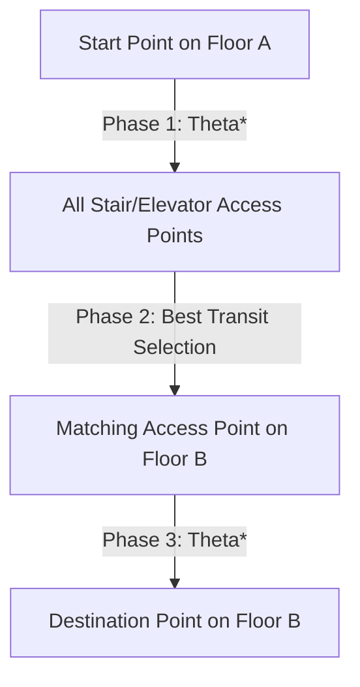

# Technical Reference: Pathfinding Architecture & Constraints

This document provides a detailed overview of the pathfinding system implemented in the Crowdsource project. It is intended for Antigravity AI agents or developers to quickly understand the code structure, algorithms, grid representation, and routing constraints.

---

## 🗺️ 1. Grid Representation & Data Structures

The pathfinding system operates entirely client-side inside a Web Worker: [pathfinder.worker.v2.js](file:///d:/Workspace/vibe/testing/crowdsource/frontend/src/workers/pathfinder.worker.v2.js).

### Grid Data Source
The grid layout and dimensions are loaded from [delta_nav_grid.json](file:///d:/Workspace/vibe/testing/crowdsource/frontend/public/data/delta_nav_grid.json), which maps:
- `cell_size`: Pixel size of each grid cell (default is `32.5` pixels/meter).
- `floors`: Map of floor IDs (e.g. `1`, `2`, `3`, `4`) containing:
  - `width` and `height`: Grid dimensions in cells.
  - `rle`: Run-length encoded array where walkable cells (`0`) and wall cells (`1`) alternate.
  - `access_points`: Coordinates and types (`stair`, `elevator`, `toilet`, `room`) of entrances/access zones.

### Run-Length Encoding (RLE) Decompression
To save memory and transfer time, grids are compressed using RLE. During decompression in `loadGrid()`:
```javascript
const grid = new Uint8Array(width * height);
let isWalkable = true;
let idx = 0;
for (let i = 0; i < floor.rle.length; i++) {
  const count = floor.rle[i];
  if (!isWalkable) {
    const end = idx + count;
    for (let j = idx; j < end; j++) {
      grid[j] = 1; // 1 represents a wall (non-walkable)
    }
  }
  idx += count;
  isWalkable = !isWalkable;
}
```

---

## 🧠 2. Theta* Pathfinding & Line-of-Sight (LOS)

Standard A* restricts paths to grid lines, resulting in jagged paths. To compute natural, smooth paths, the worker uses **Theta***.

### Line of Sight Check
Theta* performs a Supercover line-of-sight check using a modified Bresenham's algorithm to see if a shortcut can be made between the parent node and the neighbor:
```javascript
function supercoverLineOfSight(x0, y0, x1, y1, grid, width, height) {
  // Calculates all grid cells intersecting the ray from (x0, y0) to (x1, y1).
  // If any cell contains a wall (grid[y*width + x] === 1), returns false.
}
```

### Theta* Optimization
If a line of sight exists from `current.parent` to the neighbor, the neighbor's parent is directly set to `current.parent` (bypassing `current`), resulting in smooth direct paths:
```javascript
if (current.parent) {
  const px = current.parent.x;
  const py = current.parent.y;
  if (supercoverLineOfSight(px, py, nx, ny, grid, width, height)) {
    const dist = heuristic(px, py, nx, ny);
    if (current.parent.g + dist < newG) {
      parent = current.parent;
      newG = current.parent.g + dist;
    }
  }
}
```

---

## 🏢 3. Hierarchical Inter-Floor Routing

For pathfinding across different floors, the worker splits routing into a **three-phase hierarchical process** in `findHierarchicalPath()`:



### Step 1: Phase 1 (Start Floor)
Compute the shortest path from the start point to all available stair and elevator access points on the starting floor.
- Access points are loaded from `floor.access_points`.
- Terminated staircases/elevators or those in `disabledAccessPoints` are ignored.

### Step 2: Phase 2 (Transit Selection)
Choose the optimal transit point that minimizes total path distance:
$$\text{Total Cost} = \text{Cost}_1 + \text{Cost}_2 + \text{Floor Change Cost} \times |\Delta \text{Floor}| + \text{Elevator Preference}$$
- `Floor Change Cost` is set to `50` cells.
- Elevator preference adds a cost penalty of `100,000` to staircases if `preferElevator` is true.

### Step 3: Phase 3 (Destination Floor)
Compute the path from the corresponding access point on the destination floor to the final destination point.
- For transit through multiple intermediate floors, virtual stair nodes (`stair_transit`) are generated automatically to link the route.

---

## ⚠️ 4. Crowdsourced Obstacle Constraints & Avoidance

Dynamic updates (such as reports of wet floors or locked doors) are mapped directly into the pathfinding grid and constraints list.

### A. Targeted Obstacles (e.g. `room_locked`, `stairs_locked`, `elevator_broken`)
- **Warning on Locked Rooms**: If the start or destination room has an active `room_locked` report, pathfinding is bypassed entirely. The UI sets the error state `routeError: 'Phòng đã gặp sự cố'` and cancels worker execution.
- **Skipping Transit Points**: If a staircase or elevator has a `stairs_locked` or `elevator_broken` report, its `item_id` is added to `disabledAccessPoints` in the worker, preventing it from being selected during transit routing.

### B. Area Obstacles (e.g. `wet_floor`, `construction`, `debris`)
- **Grid Modification**: When active area obstacles are present and `avoidObstacles` is `true`, the worker inflates the obstacle coordinates onto the grid:
  ```javascript
  const gx = Math.floor(obs.x / cs);
  const gy = Math.floor(obs.y / cs);
  const gr = Math.max(1, Math.ceil(obs.radius / cs));
  for (let dy = -gr; dy <= gr; dy++) {
    for (let dx = -gr; dx <= gr; dx++) {
      if (dx*dx + dy*dy > gr*gr) continue;
      const nx = gx + dx, ny = gy + dy;
      if (nx >= 0 && nx < width && ny >= 0 && ny < height) {
        grid[ny * width + nx] = 1; // Mark cells as walls
      }
    }
  }
  ```
- **Avoidance Toggle**: The `avoidObstacles` state in Zustand decides whether these obstacles are sent to the worker:
  - If `true`, the worker modifies the grid, forcing Theta* to compute a path around the obstacle.
  - If `false`, the obstacles are bypassed, and the worker routes directly through the area.

---

## 🛠️ 5. Development & Testing Tools

To allow quick verification of routing rules, a collapsible floating simulator panel is integrated:
- **Component**: [TestObstaclesPanel.jsx](file:///d:/Workspace/vibe/testing/crowdsource/frontend/src/components/map/TestObstaclesPanel.jsx).
- **Features**:
  - Simulates locked rooms, locked toilets, blocked stairs, and broken elevators by adding mock obstacles to the Zustand state `activeObstacles`.
  - Simulates wet floors, construction zones, or debris by allowing clicking coordinates directly on the map.
  - Allows deleting simulated obstacles one-by-one or clearing all instantly.
