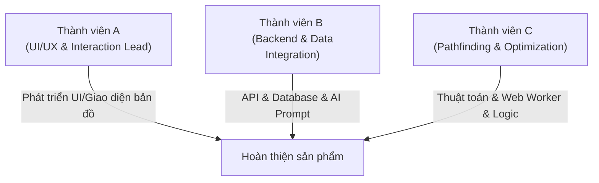

# 🗺️ Báo Cáo Phân Tích Hệ Thống & Chiến Lược Vòng Thi Phụ
## Dự án: FPTU Student Guide

Tài liệu này đánh giá hiện trạng mã nguồn của dự án **FPTU Student Guide**, đối chiếu với tiêu chí chấm điểm của Ban Tổ Chức (BTC), dự báo đề bài vòng phụ và đưa ra phương án phân bổ nhân sự tối ưu cho nhóm 3 thành viên.

---

## 1. Hiện Trạng Sản Phẩm (Đã Làm Được Gì?)

Hệ thống hiện tại là một **Hệ sinh thái hỗ trợ sinh viên Đại học FPT** với ba trụ cột cốt lõi đã được định hình rõ nét trong cấu trúc mã nguồn:

### 🧭 Bản Đồ & Định Tuyến Trong Nhà (Core Feature - Điểm Nhấn Kỹ Thuật)
* **Thuật toán tìm đường nâng cao:** Sử dụng **Theta* V2 Engine** chạy trên **Web Worker** ([pathfinder.worker.v2.js](file:///d:/fptustudent%20guild/FPTU_Student_Guide/frontend/src/workers/pathfinder.worker.v2.js)). Điều này đảm bảo hiệu năng tối ưu (0-blocking UI) khi tìm đường qua nhiều tầng.
* **Xử lý hình học thông minh:** Tích hợp thuật toán **Supercover Bresenham Line of Sight** để vẽ đường đi tự nhiên giữa các hành lang, chặn đứng lỗi "cắt góc xuyên tường".
* **Định tuyến đa tầng:** Hỗ trợ đi qua cầu thang bộ và thang máy, tính toán chi phí (stair/elevator weights) linh hoạt, có tùy chọn `preferElevator` cho người dùng.
* **Giao diện bản đồ tương tác:**
  * **Draft Image Map:** Render bản đồ tòa nhà Delta qua SVG trực tiếp từ dữ liệu tọa độ tĩnh ([DraftImageMap.jsx](file:///d:/fptustudent%20guild/FPTU_Student_Guide/frontend/src/components/map/DraftImageMap.jsx)), hỗ trợ **Tilt (xoay nghiêng 3D)**, **Rotate (xoay góc)**, **Zoom/Pan** cực kỳ mượt mà.
  * **GeoJSON Map:** Map đa năng qua Leaflet ([MapContainer.jsx](file:///d:/fptustudent%20guild/FPTU_Student_Guide/frontend/src/components/map/MapContainer.jsx)) kết nối database cho các tòa nhà/campus khác.

### 📚 Cổng Thông Tin Học Vụ (Portal)
* Cẩm nang hướng dẫn sử dụng các hệ thống FAP, FLM, CMS, Edunext ([PortalPage.jsx](file:///d:/fptustudent%20guild/FPTU_Student_Guide/frontend/src/pages/PortalPage.jsx)).
* Có bộ lọc theo hệ thống, nhóm chức năng và tích hợp **tìm kiếm highlight từ khóa** thời gian thực ([react-highlight-words](file:///d:/fptustudent%20guild/FPTU_Student_Guide/frontend/src/pages/PortalPage.jsx#L3)).

### 🤖 Trợ Lý Ảo Cóc AI
* Tích hợp chatbot thông minh thông qua **Groq API** ([groq_service.py](file:///d:/fptustudent%20guild/FPTU_Student_Guide/backend/services/groq_service.py)).
* Sử dụng prompt hệ thống ép định dạng JSON đầu ra, tự động trích xuất mã phòng (ví dụ: `DE-201`) từ câu hỏi của sinh viên.
* **Tương tác Map-Chat:** Khi Chatbot nhận dạng được mã phòng, giao diện bản đồ sẽ tự động highlight phòng học đó để chỉ đường trực quan.

### 🔐 Hệ Thống Backend & Phân Quyền
* FastAPI kết nối database PostgreSQL (PostGIS) và Supabase.
* Đăng nhập 1-chạm (SSO Google) bảo mật qua Supabase Auth.
* Middleware giải mã JWT token phục vụ phân quyền gọi AI ([auth_middleware.py](file:///d:/fptustudent%20guild/FPTU_Student_Guide/backend/middlewares/auth_middleware.py)).
* Quy trình validate dữ liệu content chặt chẽ qua Python script ([validate_content.py](file:///d:/fptustudent%20guild/FPTU_Student_Guide/scripts/validate_content.py)), đảm bảo không hiển thị thông tin rác hoặc chưa kiểm duyệt.

---

## 2. Đánh Giá Khả Năng Đáp Ứng Tiêu Chi Chấm Điểm (So với @[requiremets_BTC.md])

| Tiêu Chi Chấm | Trọng Số | Đánh Giá Mức Độ Đạt Được & Lỗ Hổng Cần Vá |
| :--- | :---: | :--- |
| **1. Tính năng & Hoàn thiện** | **25đ** | **90%** + Lõi thuật toán Theta* hoạt động hoàn hảo. + Chatbot tương tác tốt với bản đồ. ⚠️ *Lỗ hổng:* Phần rate limit cho chat trong [chat_router.py](file:///d:/fptustudent%20guild/FPTU_Student_Guide/backend/routers/chat_router.py#L21) đang bị comment lại. Cần mở ra hoặc xử lý mượt mà phòng khi BGK spam API chat. |
| **2. Giải quyết vấn đề thực tiễn** | **20đ** | **100%** + Đánh đúng vào "nỗi đau" lớn nhất của tân sinh viên FPTU: đi lạc trong tòa Delta và ngơ ngác trước hàng tá cổng dịch vụ (FAP, FLM, CMS). |
| **3. Chất lượng kỹ thuật** | **15đ** | **85%** + Code cấu trúc sạch, tách biệt module tốt. + Sử dụng Web Worker chạy thuật toán nặng giúp tăng hiệu năng UI. ⚠️ *Lỗ hổng:* Trong thư mục gốc vẫn còn sót các file rác như `debug.txt`, `debug2.txt`, `titles.txt`. Cần dọn dẹp trước khi nộp sản phẩm để tránh điểm trừ code sạch. |
| **4. Trình bày & Phản biện** | **15đ** | **Cần chuẩn bị kịch bản** + Điểm nhấn cốt lõi: Phải trình bày sâu vào **Kiến trúc kỹ thuật V2 (Theta* + Web Worker)** để BGK thấy trình độ kỹ thuật vượt trội. |
| **5. Kết quả triển khai thực tế** | **15đ** | **70%** + Có cấu hình Vercel (`vercel.json`), nhưng nhóm cần cung cấp thêm minh chứng/số liệu thử nghiệm thực tế (ví dụ: bảng khảo sát ý kiến sinh viên, log lượt truy cập). |
| **6. Giao diện & UX/UI** | **10đ** | **95%** + Giao diện hiện đại, sử dụng CSS variables đồng bộ, hiệu ứng glassmorphism, hỗ trợ responsive tốt. |

---

## 3. Dự Đoán Các Yêu Cầu Phát Sinh Trong Vòng Phụ (2 giờ 30 phút)

Dựa trên cấu trúc sẵn có của hệ thống, BTC có thể đưa ra các yêu cầu đột xuất theo 3 mức độ:

### Mức Dễ (+8 điểm)
1. **Lọc địa điểm theo danh mục:** Thêm thanh công cụ lọc nhanh trên bản đồ (chỉ hiển thị WC, chỉ hiển thị phòng học, hoặc chỉ hiển thị các văn phòng ban).
2. **Chia sẻ vị trí (Share Location):** Tạo nút copy link dẫn trực tiếp đến một phòng học cụ thể hoặc một lộ trình chỉ đường (ví dụ: `?room=DE-201` hoặc `?start=DE-107A&end=DE-201`).
3. **Dark Mode cho Bản đồ:** Chuyển đổi giao diện sáng/tối đồng bộ từ UI chính sang layout bản đồ SVG.

### Mức Trung Bình (+15 điểm)
1. **Tích hợp lịch học cá nhân (FAP Schedule integration):** Sinh viên tải lên lịch học (hoặc qua API/mock) -> Hệ thống tự động vẽ đường đi từ phòng học hiện tại sang phòng tiếp theo theo thời gian thực.
2. **Tìm kiếm phòng học trống gần nhất:** Định tuyến nhanh từ vị trí hiện tại đến phòng học không có lịch học gần nhất để tự học.
3. **Trạng thái tắc nghẽn hành lang (Hallway Traffic):** Hiển thị các vùng hành lang/thang máy đang đông đúc (đỏ/vàng/xanh) dựa trên dữ liệu mô phỏng.

### Mức Khó (+25 điểm)
1. **Chế độ chỉ đường không rào cản (Accessible Pathfinding):**
   * Cho phép người khuyết tật lựa chọn tuyến đường tránh hoàn toàn cầu thang bộ, chỉ định tuyến qua thang máy.
   * *Thuận lợi:* Nhóm đã có cờ `preferElevator`, chỉ cần tinh chỉnh trọng số cầu thang lên vô cùng để ép thuật toán chỉ đi thang máy.
2. **Chỉ đường chi tiết bằng giọng nói/văn bản (Turn-by-turn Directions):**
   * Thay vì chỉ báo "Lên tầng 2 qua cầu thang", hệ thống sẽ chỉ chi tiết: *"Đi thẳng 15m, rẽ trái ở góc hành lang, đi tiếp 10m..."* bằng cách tính toán vector hướng di chuyển giữa các node.
3. **Offline Mode:** Lưu trữ bản đồ và lõi định tuyến dưới local thông qua Service Worker và IndexedDB, đảm bảo sinh viên mất mạng dưới tầng hầm vẫn tìm được đường.

---

## 4. Phương Án Phân Chia Công Việc Cho Team 3 Người (Code Cùng Vibe)

Để làm việc nhịp nhàng trong thời gian ngắn (2h30m vòng phụ) và giữ code đồng bộ, team nên phân vai dựa theo thế mạnh cấu trúc dự án:

### 👤 Thành viên A: UI/UX & Interaction Specialist (Vibe: Sáng tạo, chi tiết)
* **Vai trò:** Phụ trách toàn bộ giao diện React, các hiệu ứng animation, responsive trên mobile, và sự tương tác trực tiếp trên bản đồ SVG (DraftImageMap).
* **Nhiệm vụ vòng phụ:**
  * Thiết kế UI cho tính năng mới (nút bấm, bộ lọc, bảng thông báo).
  * Xử lý tương tác click, zoom, rotate bản đồ đồng bộ với tính năng phát sinh.
  * Tối ưu hóa UI hiển thị chỉ đường Turn-by-turn hoặc trạng thái giao thông.
* **Tệp tin làm việc chính:** `frontend/src/pages/MapPage.jsx`, `frontend/src/components/map/*`, `frontend/src/index.css`.

### 👤 Thành viên B: Backend, Database & AI Specialist (Vibe: Logic, an toàn)
* **Vai trò:** Quản lý FastAPI, kết nối Supabase PostgreSQL, xây dựng các API router mới, tối ưu prompt cho Groq AI, xử lý bảo mật và rate limiting.
* **Nhiệm vụ vòng phụ:**
  * Viết các API mới phục vụ tính năng phát sinh (ví dụ: API trả về phòng trống, API mô phỏng lưu lượng tắc nghẽn).
  * Cập nhật database, viết script seed dữ liệu bổ sung nếu cần thiết.
  * Thiết lập cơ chế API Mock/Fallback phòng trường hợp mất mạng hoặc nghẽn mạng lúc demo.
* **Tệp tin làm việc chính:** `backend/routers/*`, `backend/services/*`, `backend/database/models.py`.

### 👤 Thành viên C: Algorithm & Optimization Specialist (Vibe: Toán học, hiệu năng)
* **Vai trò:** Quản lý lõi thuật toán định tuyến Theta* chạy trên Web Worker, xử lý dữ liệu lưới (grid data) và tính toán hình học.
* **Nhiệm vụ vòng phụ:**
  * Chỉnh sửa file Web Worker để đáp ứng điều kiện định tuyến mới (ví dụ: chế độ Accessible chỉ chọn thang máy, tính toán góc xoay giữa các node để tạo hướng dẫn "rẽ trái/rẽ phải").
  * Tối ưu hóa thuật toán để thời gian phản hồi định tuyến luôn dưới 10ms.
  * Hỗ trợ viết các script kiểm thử thuật toán định tuyến tự động ([verify_pathfinding.js](file:///d:/fptustudent%20guild/FPTU_Student_Guide/scripts/verify_pathfinding.js)).
* **Tệp tin làm việc chính:** `frontend/src/workers/pathfinder.worker.v2.js`, `scripts/build_routing_graph.py`, `scripts/validate_route_graph.py`.

---

## 5. Quy Tắc "Code Cùng Vibe" Để Tránh Xung Đột (Git & Code style)

1. **Thống nhất State qua Zustand:** Không lạm dụng useState ở các component con nếu dữ liệu đó ảnh hưởng đến luồng chính (Map, Định tuyến, Chat). Tất cả phải thông qua `useAppStore.js` để dữ liệu luôn đồng bộ một nguồn duy nhất (Single Source of Truth).
2. **Nguyên tắc "API Contract First":** Khi nhận đề bài vòng phụ, **Thành viên B** và **Thành viên A** phải ngồi lại 5 phút thống nhất cấu trúc dữ liệu JSON trả về từ API trước khi bắt đầu viết code độc lập.
3. **Git Branching chặt chẽ:** Chia nhánh theo dạng `feature/feature-name` từ nhánh chính, không commit đè trực tiếp lên `main` hay `master`.
4. **Giữ sạch môi trường chạy thử:** Khi kết thúc vòng phụ, chạy ngay lệnh `python scripts/validate_content.py` để đảm bảo không có file dữ liệu nào bị vi phạm cấu trúc và chạy `verify_pathfinding.js` để test lại lõi thuật toán định tuyến.
